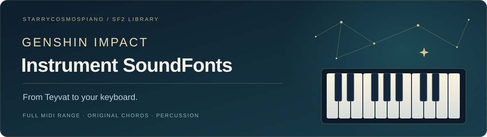

# 原神乐器 SoundFont 音源合集

[English](README.md) · **简体中文**

把提瓦特的声音带到 MIDI 键盘上。本仓库收录原神乐器与沃雅妮莎人声的 **SoundFont 2 / `.sf2`** 音源。

**[下载全部音源 · ZIP](https://github.com/StarryCosmosPiano/Genshin-Impact-Instrument-SoundFont/releases/download/v1.0.1/Genshin-Impact-Instrument-SoundFonts-v1.0.1.zip)** · [版本说明](docs/Release-Notes.zh-CN.md) · [MIDI 按键与和弦表](docs/MIDI-Mapping.zh-CN.md) · [浏览文件](soundfonts)

| 音源文件 | 全音域版本 | 原版带和弦版本 | 鼓音源 | 音源文件解压后大小 |
| :---: | :---: | :---: | :---: | :---: |
| **13 个** | **9 个** | **2 个** | **2 个** | **228.70 MiB** |

## 版本区别与命名规则

- **全音域**：覆盖全部 **128 个 MIDI 按键，编号 0–127**。文件名直接使用 `乐器名称.sf2`，不添加“全音域”或其他括号后缀。这里的全音域指键盘覆盖范围，并不表示逐键录制了 128 个独立采样。
- **原版带和弦**：保留原版乐器的单音，并加入该乐器在游戏中**原本自带的和弦**。只有这一类文件添加 `(Original with Chords)`，意思是“原版带和弦”。按键沿用所提供音源的原版布局，不作为全音域版本。
- **鼓音源**：保留原有的鼓点按键映射，文件名直接使用乐器名称。具体可用按键见 [MIDI 按键表](docs/MIDI-Mapping.zh-CN.md)。

例如，`Lingering Euphonia.sf2` 是「余音」全音域版本；`Lingering Euphonia (Original with Chords).sf2` 是「余音」原版带和弦版本。

## 音源目录

点击文件名即可单独下载对应的 `.sf2` 音源。

### 全音域 · MIDI 0–127

| 音源下载 | 乐器名称 | 大小 |
| :--- | :--- | ---: |
| [Windsong Lyre.sf2](https://raw.githubusercontent.com/StarryCosmosPiano/Genshin-Impact-Instrument-SoundFont/main/soundfonts/Windsong%20Lyre.sf2) | 风物之诗琴 | 11.30 MiB |
| [Floral Zither.sf2](https://raw.githubusercontent.com/StarryCosmosPiano/Genshin-Impact-Instrument-SoundFont/main/soundfonts/Floral%20Zither.sf2) | 镜花之琴 | 25.71 MiB |
| [Vintage Lyre.sf2](https://raw.githubusercontent.com/StarryCosmosPiano/Genshin-Impact-Instrument-SoundFont/main/soundfonts/Vintage%20Lyre.sf2) | 老旧的诗琴 | 69.09 MiB |
| [Nightwind Horn.sf2](https://raw.githubusercontent.com/StarryCosmosPiano/Genshin-Impact-Instrument-SoundFont/main/soundfonts/Nightwind%20Horn.sf2) | 晚风圆号 | 31.38 MiB |
| [Ukulele.sf2](https://raw.githubusercontent.com/StarryCosmosPiano/Genshin-Impact-Instrument-SoundFont/main/soundfonts/Ukulele.sf2) | 悠可琴 | 6.88 MiB |
| [Lingering Euphonia.sf2](https://raw.githubusercontent.com/StarryCosmosPiano/Genshin-Impact-Instrument-SoundFont/main/soundfonts/Lingering%20Euphonia.sf2) | 「余音」 | 9.31 MiB |
| [Leaping Spirit Piano.sf2](https://raw.githubusercontent.com/StarryCosmosPiano/Genshin-Impact-Instrument-SoundFont/main/soundfonts/Leaping%20Spirit%20Piano.sf2) | 跃律琴 | 16.24 MiB |
| [Harmonic Keys.sf2](https://raw.githubusercontent.com/StarryCosmosPiano/Genshin-Impact-Instrument-SoundFont/main/soundfonts/Harmonic%20Keys.sf2) | 谐律键琴 | 18.51 MiB |
| [Vodyanitsa.sf2](https://raw.githubusercontent.com/StarryCosmosPiano/Genshin-Impact-Instrument-SoundFont/main/soundfonts/Vodyanitsa.sf2) | 沃雅妮莎 | 18.39 MiB |

### 原版带和弦 · Original with Chords

| 音源下载 | 乐器名称 | 大小 |
| :--- | :--- | ---: |
| [Lingering Euphonia (Original with Chords).sf2](https://raw.githubusercontent.com/StarryCosmosPiano/Genshin-Impact-Instrument-SoundFont/main/soundfonts/Lingering%20Euphonia%20%28Original%20with%20Chords%29.sf2) | 「余音」 | 9.31 MiB |
| [Ukulele (Original with Chords).sf2](https://raw.githubusercontent.com/StarryCosmosPiano/Genshin-Impact-Instrument-SoundFont/main/soundfonts/Ukulele%20%28Original%20with%20Chords%29.sf2) | 悠可琴 | 10.62 MiB |

### 鼓音源 · Percussion

| 音源下载 | 乐器名称 | 大小 |
| :--- | :--- | ---: |
| [Arataki's Great and Glorious Drum.sf2](https://raw.githubusercontent.com/StarryCosmosPiano/Genshin-Impact-Instrument-SoundFont/main/soundfonts/Arataki%27s%20Great%20and%20Glorious%20Drum.sf2) | 荒泷・盛世豪鼓 | 78.7 KiB |
| [Djem Djem Drum.sf2](https://raw.githubusercontent.com/StarryCosmosPiano/Genshin-Impact-Instrument-SoundFont/main/soundfonts/Djem%20Djem%20Drum.sf2) | 聚聚鼓 | 1.88 MiB |

## 使用方法

1. 从上表下载单个 `.sf2` 文件，或下载 [完整 ZIP 音源包](https://github.com/StarryCosmosPiano/Genshin-Impact-Instrument-SoundFont/releases/download/v1.0.1/Genshin-Impact-Instrument-SoundFonts-v1.0.1.zip) 并解压。
2. 在支持 SoundFont 的合成器、采样器或音乐软件中载入 `.sf2` 文件。
3. 选择音源预设，将 MIDI 键盘或 MIDI 轨道连接到该音源。
4. 使用原版带和弦版本或鼓音源时，按照 [MIDI 按键与和弦表](docs/MIDI-Mapping.zh-CN.md) 演奏。

**预设选择**：所有音源均使用 **Bank 0、Program 0**。Program 从 0 开始编号；如果软件从 1 开始显示，预设可能显示为 **1**。

若某个按键没有声音，请先检查当前文件的版本、预设和映射范围。两个鼓音源及原版带和弦版本并不覆盖所有按键。

### 其他下载方式

- [下载整个仓库 ZIP](https://github.com/StarryCosmosPiano/Genshin-Impact-Instrument-SoundFont/archive/refs/heads/main.zip)，获取当前音源及说明文档。
- 打开 [`soundfonts/` 文件夹](soundfonts)，进入文件页面后点击 **Download raw file** 下载原始文件。
- 也可以通过 Git 克隆整个仓库，**无需 Git LFS**。

```sh
git clone https://github.com/StarryCosmosPiano/Genshin-Impact-Instrument-SoundFont.git
```

## 文件完整性与鸣谢

13 个音源保留原始采样数据和按键映射。[SHA256SUMS.txt](SHA256SUMS.txt) 提供校验值，[catalog.json](catalog.json) 记录音源名称、版本、大小和 MIDI 映射信息。

音源由 **[星宇](https://github.com/StarryCosmosPiano)** 制作与维护。原始游戏音频来自 **《原神》／HoYoverse／miHoYo**。

遇到下载或按键映射问题，可在 [Issues](https://github.com/StarryCosmosPiano/Genshin-Impact-Instrument-SoundFont/issues) 中提供文件名、使用的软件及 MIDI 按键编号。
